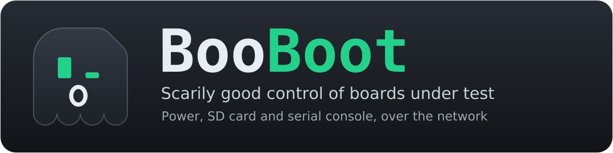

<p align="center"></p>

Remote control of an embedded board that boots from an SD card: power, SD
card content and serial console, over the network.

A small Linux board (like an old Raspberry Pi) sits next to the board under
test (the DUT). It switches the DUT power with a relay, changes the SD card
content through a USB-SD-Mux FAST (Linux Automation GmbH), and reads and
writes the DUT serial console through a USB UART adapter. Any program on the
network can use it through a simple HTTP and JSON API. A command line tool
and a Python library are included.

- [Installation from zero](docs/install.md)
- [Hardware](docs/hardware.md)
- [Setup runbook for agents](docs/agent-setup.md)
- [Usage runbook for agents](docs/agent-use.md)
- [Architecture](docs/architecture.md)
- [HTTP API](docs/api.md)
- [First bring-up](docs/bringup.md)
- [MCP server](docs/mcp.md)
- [BooBoot Console](docs/console.md)
- [Console web page](docs/web.md)
- [Remote access: VPN, other networks](docs/remote.md)
- [Scripts on the BooBoot board](docs/scripts.md)
- [Visuals: logo and icons](docs/brand/README.md)

## Start with an agent

An agent that can run shell commands on your computer can lead the whole
setup: it asks what is already done, tells you the manual steps, installs and
tests the rest over SSH, and reports each step in `booboot-setup-report.md`.

1. Use an agent that runs on your computer, on the same network as the Pi: it
   reaches the Pi over SSH.
2. Create an empty folder for the setup report, and start the agent in it.
3. Give it this message, with your own details:

   ```text
   Set up BooBoot on my Raspberry Pi. Read
   https://raw.githubusercontent.com/sonatique/BooBoot/main/docs/agent-setup.md
   completely, then follow it from phase 0. The other guides it refers to
   are in the same folder of the repository.

   What I know already:
   - Board: [Raspberry Pi model]
   - Done so far: [nothing yet, or the steps of docs/install.md already done]
   - Relay: [not bought yet, module type, or relay HAT]
   - DUT serial speed: [921600], I/O voltage: [3.3 V], DUT supply: [24 V DC]
   ```

To go on later, start a new session in the same folder with the same message:
the agent finds the report file and continues from there. The rules the agent
follows are in [docs/agent-setup.md](docs/agent-setup.md).

To use a unit that is set up, tell the agent, even in the middle of a task:

```text
Start using BooBoot for testing this. Read
https://raw.githubusercontent.com/sonatique/BooBoot/main/docs/agent-use.md
and follow it, with the unit at booboot.local.
```

The agent checks the unit without changing it, installs the client and
BooBoot Console on your computer if needed, starts BooBoot Console for you,
explains the basics, and goes on with the task. It treats the unit as shared
with colleagues: it never takes the DUT from someone, asks before it
disturbs a DUT that is on, and holds the session only while it uses it. With
an SSH login on the BooBoot board, write `USER@booboot.local`: the agent then
also checks the service. The rules it follows are in
[docs/agent-use.md](docs/agent-use.md).

## Server setup (on the Raspberry Pi)

1. Write Raspberry Pi OS Lite (any model, 32 or 64 bit) with Raspberry Pi
   Imager, with hostname `booboot` and SSH on. Connect it to the network.
2. Connect the relay driver to GPIO17 (pin 11, see the pin table in
   [Installation from zero](docs/install.md#2-wiring)), the USB-SD-Mux FAST
   and the USB UART adapter.
3. Install:

   ```sh
   sudo apt update
   sudo apt install -y git
   git clone https://github.com/sonatique/BooBoot.git
   sudo BooBoot/server/install.sh
   ```

4. Follow [First bring-up](docs/bringup.md): it checks the relay, the SD card
   and the serial console one by one before the DUT is connected.

Step by step, with the wiring and the desktop side:
[Installation from zero](docs/install.md).

## Client

`client/booboot.py` needs only Python 3.9 or later, on Linux, macOS or
Windows. Copy it anywhere.

```sh
export BOOBOOT_URL=http://booboot.local:8080

booboot status
booboot deploy BOOT.BIN image.ub --expect "login: " --timeout 120
booboot console run root
booboot console run "uname -a"
booboot boottime "login: " --runs 5  # power on to login prompt, 5 boots
booboot console attach              # interactive terminal, Ctrl-] to quit
booboot session close
```

Long work, like a boot loop over a night, can run on the BooBoot board as a
Python script, which goes on if the connection drops:
`booboot script run boots.py 500`. Scripts are off by default:
[scripts.md](docs/scripts.md).

Other commands: `booboot --help`, and `booboot COMMAND --help`.

For C#, `client/csharp/BooBootClient.cs` is a small client class (.NET 6 or
later, no package needed), with an example program in `client/csharp/Example`.
Other languages can use the [HTTP API](docs/api.md) directly.

`booboot mcp` runs an [MCP server](docs/mcp.md) on standard input and output,
so that MCP clients can use the DUT through tools.

To watch the serial console live, open `http://booboot.local:8080/` in any
browser: the [console web page](docs/web.md), served by the BooBoot board.
[BooBoot Console](docs/console.md) does the same as a desktop program
(Windows, Linux, macOS), with log files on the desktop. The
[latest release](https://github.com/sonatique/BooBoot/releases/latest) has it
ready to run for Windows and Linux. Both need no session to watch, so they
can watch while an agent works. "Take control" in either
opens the session, to type into the console.

## Development

Run the server with a simulated board, no hardware needed:

```sh
cd server && python3 -m booboot_server --fake --port 8080
```

Run the tests (as root, the tests with loop devices and GPIO run too):

```sh
python3 -m unittest discover -s tests
```

CI (GitHub Actions) runs a lint check and the tests on Python 3.9, 3.11 and
3.14 (with the web page in headless Chrome), once as root, runs the client
tests on Windows and macOS, checks the C# client and BooBoot Console against a
server with a simulated board, builds BooBoot Console for Windows and Linux,
and runs `server/install.sh` on a machine with systemd, with the relay on a
simulated GPIO chip.

## Releases

Make a release on the GitHub page (Releases, "Draft a new release", with a
new tag like `v0.3.0` on `main`), or push a tag:

```sh
git tag v0.3.0
git push origin v0.3.0
```

Or run the Release workflow (Actions, "Release", "Run workflow") with the
version, like `0.3.1`: it does the same from `main`, and creates the tag
`v0.3.1` itself. Agents that can start workflows but not push tags use it.

CI runs all the checks, then adds to the release BooBoot Console for Windows
and Linux, `booboot.py`, and their SHA-256 sums in `SHA256SUMS`. The tag
gives the version: no file needs editing. CI writes it into the released
files, and on the BooBoot board `install.sh` takes it from git: `0.3.0` for
the tagged commit, `0.3.0-2-gabc1234` for a later one, `dev` without git.
