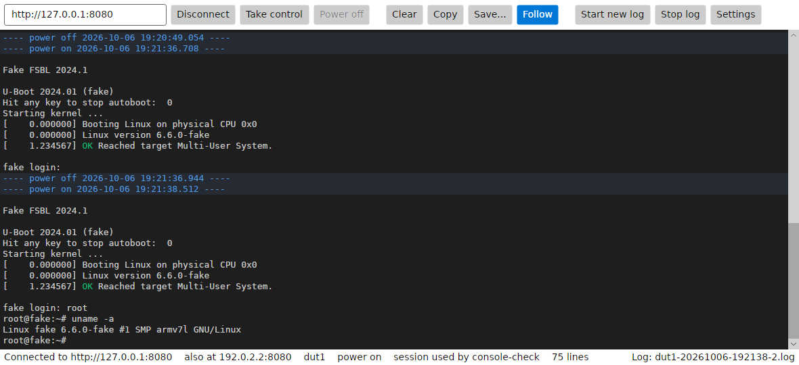

# BooBoot Console

A desktop program that shows the serial console of the DUT, live, as a
terminal connected to it would. Watching needs no session, so agents and
other clients use the DUT as usual, and the console data is not changed in
any way. To type into the console, take control: see [Typing](#typing).



To watch with nothing to install, the BooBoot server also has a
[console web page](web.md).

## Features

- **Live output.** The server sends each read from the serial port at once.
- **Output from before.** The server keeps the last 8 MB of output
  (`buffer_size` in the server configuration). The window shows it at start.
- **Terminal text.** Colors, carriage returns, backspaces and line erase work
  as in a terminal.
- **Power switches.** A line shows each power on and power off, with its time.
- **Scrollback.** 200,000 lines by default. Long lines wrap.
- **Follow.** The view follows new output. Scrolling up stops it, so that the
  text stays in place. End or the Follow button starts it again.
- **Copy and save.** Select with the mouse (double-click: word, triple-click:
  line), copy with Ctrl+C, select all with Ctrl+A. Save writes all the text
  to a file (Ctrl+S). Clear (Ctrl+L) empties the view.
- **Logs.** "Start new log" writes all output from now on to a new file
  `PREFIX-YYYYMMDD-HHMMSS.log` in the log folder. The prefix is the DUT name
  unless set. Options: start a log when connected, and a new log file at each
  power on. Logs have the text without escape codes, one line per line.
- **Connection.** When the connection is lost, the program connects again and
  continues where it was: no output is lost unless it left the server memory
  in between (a line then says how many bytes were lost). A line also says
  when the server was restarted.

The status bar shows the connection, the DUT name, the power state, and which
client has the session.

## Typing

"Take control" opens the BooBoot session, in the name of
`BooBoot Console USER@COMPUTER`. While it is open, other clients that need
the session (agents, `booboot` commands) get `busy`, as with any session.
A blue frame shows that the keys go to the DUT. The view then shows the
cursor, and follows the output at each key.

- **Keys.** Text, Enter, Backspace, Tab, Escape, the arrows, Home, End,
  Insert and Delete are sent as a terminal sends them. Ctrl+letter sends the
  control character: Ctrl+C stops a program on the DUT, Ctrl+D ends a shell.
- **Copy and paste.** Ctrl+C copies when text is selected; with no selection
  it goes to the DUT. Ctrl+Shift+C always copies. Ctrl+V pastes the clipboard
  to the DUT, with each line break sent as Enter.
- **View commands.** Page Up and Page Down still scroll. With Ctrl+Shift:
  Ctrl+Shift+A selects all, Ctrl+Shift+L clears, Ctrl+Shift+S saves.
- **Release.** "Release control" closes the session. Closing the window also
  does. When no key is sent for the session timeout (300 s by default), the
  session ends and the status bar says so.
- **Busy.** If another client has the session, the program shows who and its
  idle time, and asks before taking it over. If another client takes it
  over, typing stops and the status bar says who.

## Run

**Ready-built program.** Each release has a single program file for Windows
and Linux, with nothing else to install. From the
[latest release](https://github.com/sonatique/BooBoot/releases/latest), download `BooBootConsole-win-x64.exe` or
`BooBootConsole-linux-x64`. On Linux, make the file executable first:
`chmod +x BooBootConsole-linux-x64`. CI also builds them at each push: the
artifacts of the latest CI run have the changes made since the release (a
GitHub login is needed, and they are kept 30 days).

**From the sources**, on any system with the .NET 10 SDK:

```sh
dotnet run --project client/csharp/BooBootConsole -- http://booboot.local:8080
```

To build a single program file yourself (RID: `win-x64`, `linux-x64`,
`linux-arm64`, `osx-arm64`, ...):

```sh
dotnet publish client/csharp/BooBootConsole -c Release -r win-x64 --self-contained \
    -p:PublishSingleFile=true -p:IncludeNativeLibrariesForSelfExtract=true \
    -p:EnableCompressionInSingleFile=true -p:PublishReadyToRun=true -p:PublishTrimmed=true \
    -o publish
```

`PublishTrimmed` leaves out the parts of .NET that the program does not use,
and `PublishReadyToRun` compiles it ahead of time. Together they make a file
of about 35 MB that shows its window in well under a second.

The build uses Avalonia, which sends anonymous usage data while building. Set
`AVALONIA_TELEMETRY_OPTOUT=1` to turn this off.

The server address comes from the command line, or else is the last one
used. Run the program once per DUT to watch several.

## Settings

The Settings button opens them. They are kept in `settings.json`, in
`%APPDATA%\BooBootConsole` on Windows and `~/.config/BooBootConsole` on Linux
and macOS.

| Setting | Default |
|---|---|
| Log folder | `BooBoot logs` in the documents folder |
| File name prefix | the DUT name |
| Start a log when connected | off |
| New log file at each power on | off |
| Scrollback lines | 200,000 |
| Text size | 13 |
| Fonts | Cascadia Mono, Consolas, Menlo, DejaVu Sans Mono, Liberation Mono, monospace (the first one found) |

## How it works

The program reads `GET /api/v1/console/stream` (see [api.md](api.md)): one
HTTP connection on which the server sends the output and the power switches
as they come. The server reads the serial port all the time, whether viewers
are connected or not. Viewers only read its memory, so the DUT does not see
them, and any number of them can watch. A slow viewer never slows the server:
if it falls behind by more than the server memory, it skips output.
Taking control opens a session (`POST /api/v1/session`), and the keys go
through `POST /api/v1/console/write`.

## Limits

- The view is line based: it only writes to the last line, like a log.
  Programs that draw on the whole screen (`top`, `vi`, `menuconfig`) do not
  show well. For them, use `booboot console attach` in a terminal.
- Characters wider than others (CJK, emoji) break the alignment of their line.
