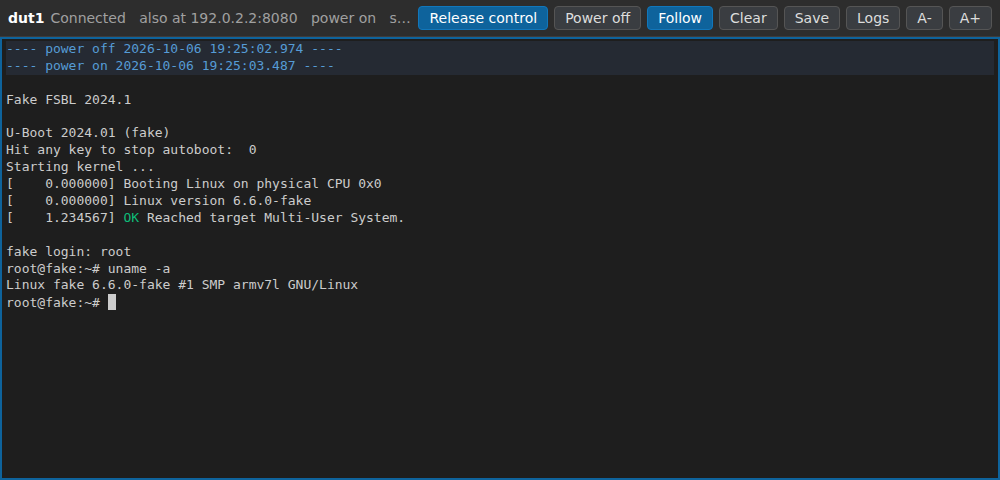

# Console web page

The BooBoot server has a web page that shows the serial console of the DUT,
live: open `http://booboot.local:8080/` (the server address) in any browser,
on a computer, a tablet or a phone. Nothing to install.



Like [BooBoot Console](console.md), watching needs no session, so agents
and other clients use the DUT as usual, and the console data is not changed
in any way. Any number of people can watch at the same time. To type into
the console, take control: see [Typing](#typing).

## Several DUTs

With several DUTs on the board, `http://booboot.local:8080/` lists them, with
the power state, the client that has the session and the running script of
each, updated every 3 s. A click on a name opens the console page of that
DUT, at `http://booboot.local:8080/duts/NAME/`. On a console page, a list
next to the DUT name goes to another DUT of the board. Both show the label
of each DUT, if it has one.

## Features

- **Live output**, and the output kept by the server from before (8 MB by
  default).
- **Terminal text**: colors, carriage returns, backspaces and line erase.
- **Power switches**: a line shows each power on and power off, with its time.
- **Follow**: the page follows new output. Scrolling up stops it, so that the
  text stays in place. Scrolling back to the end, End or the Follow button
  starts it again. It also waits while text is being selected.
- **Copy**: select with the mouse and copy as usual. Line breaks and empty
  lines are kept.
- **Search**: the browser search (Ctrl+F) finds text in all the lines kept.
- **Save** downloads all the text as a file. **Clear** empties the page (not
  the server memory).
- **Logs** lists the log files that the server writes, one per power on, each
  line with its time since power on. A click downloads one.
- **A- and A+** change the text size. The browser remembers it.
- **Connection**: when the connection is lost, the page connects again and
  continues where it was. A line says when the server was restarted.
- **Address**: opened with a name, the page shows the address of the board
  (`also at 10.1.2.3:8080`), for where the name does not work, like over a
  VPN ([remote.md](remote.md)).

## DUT panel

The DUT button, next to "Power", shows the DUT on the board, the same for
everyone: its name and address (to copy), its label, its serial adapter and
baud rate, its relay and power state, the side of its SD card, and the
version and addresses of the BooBoot server, or "no relay", "no USB-SD-Mux"
or "no serial console" for a part that the DUT goes without. The label is free text shown
with the name here, in BooBoot Console and by `booboot status`, like
`ZCU102 rev B, bench 3`. In control, "Set label" (or Enter) changes it for
everyone; empty removes it. Keys typed in the panel stay there, also in
control. Escape or a click elsewhere closes it.

## Typing

"Take control" opens the BooBoot session, in the name of the address of the
browser computer. While it is open, other clients that need the session
(agents, `booboot` commands) get `busy`, as with any session. A blue frame
shows that the keys go to the DUT, and the page shows the cursor.

When another client has the session, the page asks before taking it over:

- **Gone**: a viewer or MCP server that stopped its heartbeats 30 s ago or
  more, like a page or program closed abruptly. The status shows
  `used by NAME (gone)`. Taking over is safe.
- **Connected**: a viewer or MCP server that still runs. Someone may be
  using the DUT: taking over interrupts their work.
- Other clients, like `booboot` commands, send no heartbeat: the page shows
  their idle time only.

While in control, the page sends a heartbeat every 10 s.

- **Keys.** Text, Enter, Backspace, Tab, Escape, the arrows, Home, End,
  Insert and Delete are sent as a terminal sends them. Ctrl+letter sends the
  control character: Ctrl+C stops a program on the DUT, Ctrl+D ends a shell.
  Page Up and Page Down still scroll.
- **Copy and paste.** Ctrl+C copies when text is selected; with no selection
  it goes to the DUT. Pasting (Ctrl+V) sends the text to the DUT, with each
  line break sent as Enter.
- **Power.** Next to "Take control", "Power on" or "Power off", after the
  power state of the DUT, switches it. It works only in control. "Power off"
  asks first. Power on also gives the SD card back to the DUT. A DUT without
  relay has no power button.
- **Label.** The DUT panel sets the label of the DUT, in control: see
  [DUT panel](#dut-panel).
- **Release.** "Release control" closes the session. Closing or reloading the
  page also does. When no key is sent for the session timeout (300 s by
  default), the session ends and the status line says so.
- **Busy.** If another client has the session, the page shows who and its
  idle time, and asks before taking it over. If another client takes it
  over, typing stops and the status line says who.

The page keeps the last 50,000 lines. `?lines=N` in the address changes it,
like `http://booboot.local:8080/?lines=200000`.

## Web page or desktop program

| | Web page | BooBoot Console |
|---|---|---|
| Install | nothing | a program file |
| Devices | any browser, phones too | Windows, Linux, macOS |
| Log files | the ones on the BooBoot board | on the desktop, started when you want |
| Lines kept | 50,000 by default | 200,000 by default |

## Turn it off

In the configuration of the board (`/etc/booboot/server.ini`):

```ini
[server]
web = no
```

then `sudo systemctl restart booboot`. The API, the stream included, stays
available.

## How it works

The page is three small files and its icon, served by the BooBoot server
itself (`server/booboot_server/web/`), with nothing loaded from the
internet. It reads `GET /api/v1/console/stream` (see [api.md](api.md)) and
lists the logs with `GET /api/v1/logs`, under `/duts/NAME` for DUT NAME. The
server reads the serial port all the time; viewers only read its memory, so
the DUT does not see them. Taking control opens a session
(`POST /api/v1/session`), and the keys go through `POST /api/v1/console/write`.
The list of DUTs reads `GET /api/v1/duts`.

## Limits

- As in BooBoot Console, the view is line based. Programs that draw on the
  whole screen (`top`, `vi`, `menuconfig`) do not show well: use `booboot
  console attach` in a terminal for them.
- Typing needs a keyboard: phones and tablets need a physical one, as the
  page does not open the on-screen keyboard.
- On a trusted network, anyone who can reach the server can watch and type,
  as with the API.
